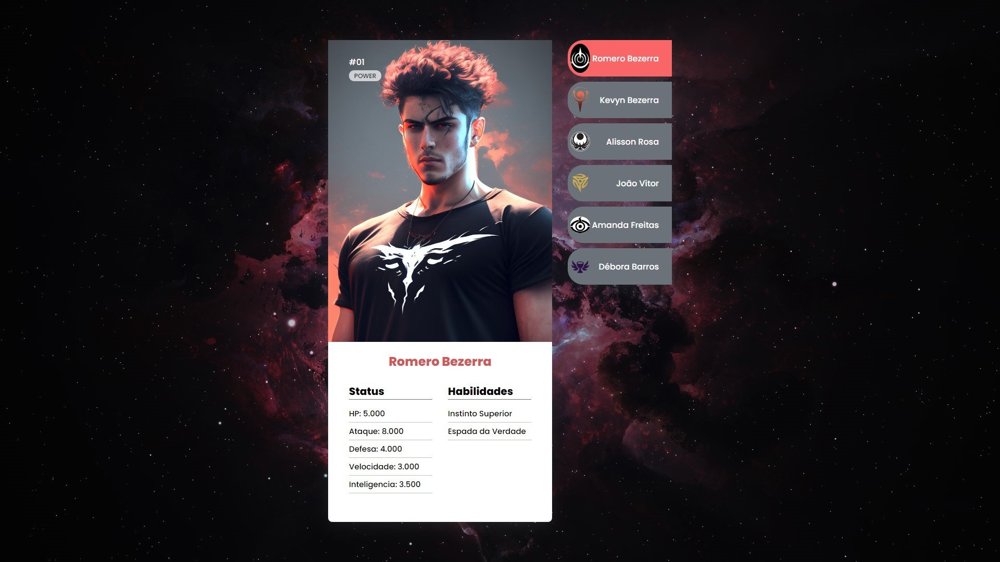

<h1 align="center">.:| Projeto Fichas |:.</h1>

  
  

 

<h2 align="center">📖Descrição</h2>

Projeto baseado no evento MAPADEV WEEK do canal Dev em Dobro. Aqui eu utilizo HTML5, CSS3 e Javascript, 100% responsivo. As imagens foram geradas na inteligência artificial MidJourney.

 

<h2 align="center">🖥Preview</h2>
</img>

 

#### Veja o projeto funcionando <a href="https://kevynfirst.github.io/projeto-fichas">aqui</a>. 👈

 

<h2 align="center">🛠 Tecnologias</h2>

- [HTML5](https://html.com/)
- [CSS3](https://developer.mozilla.org/pt-BR/docs/Web/CSS)
- [Javascript](https://www.javascript.com/)
- [MidJourney](https://www.midjourney.com/home/?callbackUrl=%2Fapp%2F/)

 

<h2 align="center">Obrigado por visitar meu projeto 😉</h2>

Você pode conferir outros projetos que desenvolvi aqui no meu GitHub, ou entrar em contato comigo pelos demais links.

